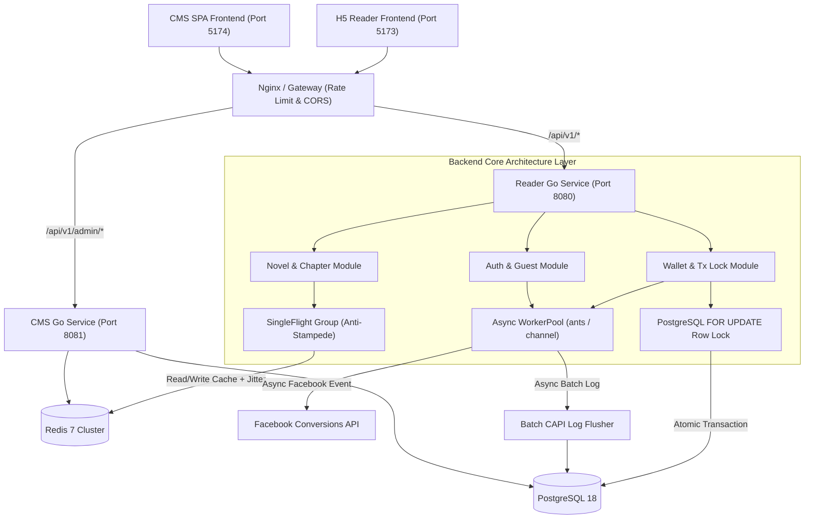

<p align="center">
  
</p>

# STAR NOVEL - 海外小说平台与运营管理系统

## 📝 1. 系统描述 (System Description)

**STAR NOVEL** 是一套面向海外网络文学市场的现代化、高并发、全功能网络文学阅读平台与运营管理系统 (CMS)。

系统整体采用前后端分离拓扑架构，由**移动端 H5 读者前端 (`reader-front`)**、**运营管理后台前端 (`cms-front`)**、**读者端 Go 后端 API (`reader-backend`)** 以及 **CMS 运营 Go 后端 API (`cms-backend`)** 四大子系统构成。系统深度针对海外网文买量引流、付费墙划扣、广告归因及高并发阅读场景进行定制化架构设计：
- 基于 **Go 1.25 (Gin + pgxpool + go-redis)** 提供微秒级响应的高性能 RESTful API；
- 集成 **Stripe & PayPal** 海外合规支付网关与 6 卡位灵活充值/VIP订阅模版；
- 集成 **Facebook Conversions API (CAPI)** 动态广告事件归因与多 Pixel 追踪；
- 具备**行级排他锁金币钱包**、**SingleFlight 防击穿**、**带随机抖动 (Jitter) 的 Cache-Aside 多级缓存**与**高并发 WorkerPool 协程池**机制。

---

## 🌟 2. 功能特性 (Features)

### 📖 2.1 H5 读者端与云同步阅读器 (`reader-front` & `reader-backend`)
- **即开即读与游客鉴权**：基于设备指纹与 IP 的游客免密自动注册，自动发放迎新赠送金币，无缝过渡至正式账户。
- **高安全防爬收费墙**：支持设定免费阅读章节区间（如 1~2 章免费），付费章节接口执行严格鉴权与正文切片裁剪（Preview Slice）。
- **云端阅读进度同步**：基于防冲突时间戳对账算法与客户端 2 秒防抖队列，确保多设备间同步阅读历史与滚动位置不被覆盖。
- **多渠道快捷支付**：无缝对接 Stripe Credit Card 绑卡交易与 PayPal 快捷结算。

### 📊 2.2 全功能运营管理后台 (`cms-front` & `cms-backend`)
- **小说内容管理**：支持小说元数据编辑、单章录入、ZIP 压缩包/单 TXT 大文本智能正则切分批量导入，以及按字数自动计算定价。
- **充值模板管理**：支持灵活配置 6 卡位充值模版（单次充值、VIP 周/月订阅、全本解锁），内置赠币上限校验与一键设为默认。
- **订单统计与退款**：提供全维度订单列表与数据大盘；支持一键退款，系统自动在数据库事务中划扣用户已充本金与赠币。
- **域名管理**：支持主域名与引流营销子域名的统一接入、状态启停调控与默认 H5 入口一键切换。
- **像素管理与广告回传**：支持多 FB Pixel 管理、Facebook CAPI 转化事件异步跟踪、日志审计与失败事件手动一键补发。
- **推广链接管理**：支持关联目标小说、落地章节、UTM 渠道参数、指定 Pixel 与充值模版一键生成引流 URL。
- **用户管理与风控**：支持多维度用户检索、消费流水与已购章节透视、一键封禁账号以及管理员人工赠扣金币。
- **系统设置与权限**：支持管理员 RBAC 角色分配、全站千字金币定价控制与敏感操作审计日志。

### ⚡ 2.3 高并发与高可用 Go 架构
- **面向接口三层分层与标准目录 (Standard Layout)**：遵循 `Handler -> Service -> Repository` 面向接口规范，双端统一收拢至 `cmd/server/main.go` 入口，消除包名与文件名语义冗余。
- **行锁串行化与唯一索引防刷 (Atomic Row Lock & Index Defense)**：章节解锁优先施加 `wallets FOR UPDATE` 行锁，锁定后再校验解锁状态，彻底杜绝并发双扣；每日签到结合 Redis `SetNX` 锁与 `(user_id, date)` 局部唯一索引建立双重防刷防线。
- **支付防篡改与精准 Slot 绑定 (Payment Security)**：基于 `slot_id` 精确检索档位，强制比对 PayPal 实际结算金额与后台配置价格，阻断越权篡改发货。
- **SingleFlight 防击穿与 Jitter 缓存在线防护**：热门小说与章节列表查询集成 `singleflight.Group` 请求合并；Redis TTL 增加 0~20% 随机抖动防止雪崩，CMS 端使用非阻塞 `SCAN` 迭代器替代 `KEYS` 指令。
- **池化异步 Task 引擎与 Batch 日志**：带 `recover()` 崩溃保护与容量限制的全局 `WorkerPool` 调度 CAPI 广告跟踪；CAPI 日志采用 5000 缓冲 Channel + 批量 Transaction 异步落盘，保护 `pgxpool` 连接池。
- **PostgreSQL GIN 三元组索引与标量查询优化**：引入 `pg_trgm` 扩展建立 GIN 三元组索引，加速小说与作者模糊搜索；剔除 `GetNovels` 中 `system_configs` 逐行 `N+1` 标量子查询开销。
- **生产安全强校验与 IP 令牌桶限流**：生产环境 (`GIN_MODE=release`) 强制校验 `JWT_SECRET` 密钥；CORS 动态反射请求 Origin 标头；在 `/auth/guest` 部署基于 IP 的速率限制器 (`golang.org/x/time/rate`)，防范脚本批量刷号。

---

## 🛠️ 3. 技术栈 (Tech Stack)

| 领域 | 核心技术选型 | 说明 |
| :--- | :--- | :--- |
| **读者端前端 (`reader-front`)** | React 19, Vite 8, React Router v6, Lucide React | 移动端 H5 响应式适配，微秒级阅读动效 |
| **CMS 前端 (`cms-front`)** | React 19, Vite 8, Lucide React, Custom Select | 运营可视化数据仪表盘 |
| **读者端后端 (`reader-backend`)** | Go 1.25, Gin Framework, pgxpool, go-redis/v9, SingleFlight | 高并发 REST API (默认端口 `8080`) |
| **CMS 后端 (`cms-backend`)** | Go 1.25, Gin Framework, pgxpool, go-redis/v9 | 运营管理 API (默认端口 `8081`) |
| **存储基础设施** | PostgreSQL 18, Redis 7, pg_trgm (Gin Index) | Docker 容器化部署，全文模糊搜索索引 |
| **支付与广告追踪** | Stripe SDK, PayPal REST API, Facebook CAPI | 海外合规支付网关与 CAPI 异步追踪 |

---

## 🏗️ 4. 架构设计 (Architecture Design)



---

## 📁 5. 目录结构 (Directory Structure)

```text
star-novel/
├── reader-backend/                      # 读者端 Go 后端服务 (Port 8080)
│   ├── cmd/server/                      # 读者端入口与依赖注入
│   ├── db/                              # 数据库 Schema 初始化脚本与种子数据
│   └── internal/                        # 读者端核心业务包
│       ├── auth/                        # 鉴权与游客登录 (含 IP Rate Limit)
│       ├── config/                      # 全局配置加载与强校验
│       ├── db/                          # PostgreSQL 连接池初始化
│       ├── model/                       # 领域模型定义
│       ├── novel/                       # 小说与章节读写 (SingleFlight & Jitter Cache)
│       ├── payment/                     # Stripe & PayPal 支付网关对接
│       ├── redis/                       # Redis 缓存连接池
│       ├── shelf/                       # 书架与云端阅读进度同步
│       ├── tracking/                    # FB CAPI 追踪与异步 Batch 日志落盘
│       ├── wallet/                      # 行锁金币钱包、代币扣减与签到防刷
│       └── workerpool/                  # 带 Recover 的全局异步协程池
├── cms-backend/                         # 运营后台 Go 后端服务 (Port 8081)
│   ├── cmd/server/                      # CMS 入口 (Standard Project Layout 规范)
│   └── internal/                        # CMS 业务内部分层
│       ├── auth/                        # 管理员鉴权、JWT 与 RBAC 权限
│       ├── billing/                     # 充值模版配置、6 卡位价格与订单退款划扣
│       ├── config/                      # 配置加载与 config.Get() 导出
│       ├── db/                          # pgxpool 连接池、表结构 Migration 与 Seed
│       ├── domain/                      # 主域名与营销子域名调控
│       ├── novel/                       # 小说/章节管理、按字数计费与 ZIP/TXT 导入
│       ├── redis/                       # Redis 缓存客户端
│       ├── tracking/                    # FB CAPI 日志大盘审计与失败事件补发
│       └── user/                        # 读者用户风控、封号与人工充扣币
├── reader-front/                        # 读者端 H5 移动前端 (Port 5173)
├── cms-front/                           # 运营后台 SPA 前端 (Port 5174)
│   └── public/assets/                   # 双星 LOGO 等静态资源
├── development_guidelines.md            # 后端开发分层与并发控制规范
└── DEVELOPMENT.md                       # 项目迭代历史日志
```

---

## 🚀 6. 快速入门 (Quick Start)

### 6.1 环境准备 (Prerequisites)
- **Go**：1.25 或更高版本
- **Node.js**：18+ 与 npm
- **Docker & Docker Compose**

### 6.2 启动基础设施 (PostgreSQL & Redis)
进入 `reader-backend/` 目录并使用 Docker 启动容器服务：
```bash
cd reader-backend
docker-compose up -d
```
* **PostgreSQL**：运行于 `localhost:5432`（数据库: `star_novel`，用户: `postgres`，密码: `postgres123`）
* **Redis**：运行于 `localhost:6379`

### 6.3 启动后端 API 服务 (Backend Services)

#### 启动读者端后端服务 (Port 8080)：
```bash
cd reader-backend
go run cmd/server/main.go
```

#### 启动 CMS 运营后台后端服务 (Port 8081)：
```bash
cd cms-backend
go run cmd/server/main.go
```

### 6.4 启动前端 SPA 服务 (Frontend Apps)

#### 启动读者端 H5 (Port 5173)：
```bash
cd reader-front
npm install
npm run dev -- --port 5173
```
浏览器访问: `http://localhost:5173/`

#### 启动 CMS 运营管理面板 (Port 5174)：
```bash
cd cms-front
npm install
npm run dev -- --port 5174
```
浏览器访问: `http://localhost:5174/`

### 🔐 默认管理员账号 (Default Credentials)
初始部署后，可在 CMS 登录界面使用默认初始账号：
* **后台登录地址**：`http://localhost:5174/`
* **用户名**：`admin`
* **初始密码**：`admin123`

---

## 📄 7. 开源协议 (License)

Copyright © 2026 STAR NOVEL Team. All rights reserved.
